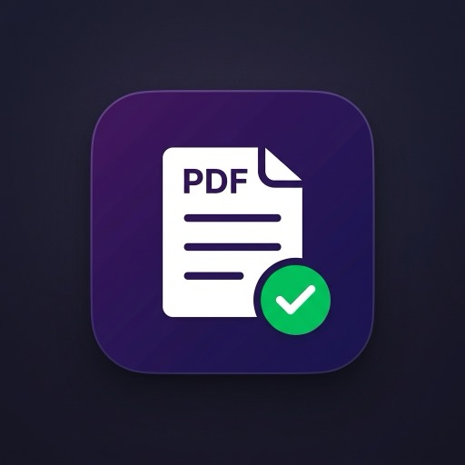

<div align="center">



# 📄 PDF Wallet

**A lightweight Progressive Web App to store, manage and view your PDF documents — entirely in the browser.**

[](https://svelte.dev)
[](https://vitejs.dev)
[](https://web.dev/progressive-web-apps/)
[](https://developer.mozilla.org/en-US/docs/Web/API/Web_Crypto_API)
[](https://vitest.dev)
[](LICENSE)

</div>

---

## ✨ Features

| Feature | Description |
|---|---|
| ➕ **Add PDFs** | Click the upload zone or drag-and-drop one or multiple PDF files at once |
| ✏️ **Rename PDFs** | Edit a filename inline; an Undo button on the card restores the previous name |
| 📤 **Share PDFs** | Opens the device share sheet for targets such as WhatsApp; downloads the file when file sharing is unavailable |
| 🗑️ **Delete PDFs** | Two-step delete confirmation to prevent accidental removal |
| 🔗 **Open PDFs** | Click the filename to open the document in a new tab using a temporary Blob URL |
| 🔐 **Encryption at rest** | PDF contents are encrypted with AES-256-GCM (Web Crypto) before hitting `localStorage` |
| 🔍 **Search** | Real-time filter by file name |
| 📊 **Storage stats** | Shows total PDF count and localStorage space used |
| 🔔 **Toast notifications** | Success, error and info feedback for every action |
| ⚠️ **Quota guard** | Friendly error if the localStorage 5 MB limit is exceeded |
| 📱 **PWA** | Installable on desktop and mobile (Chrome, Edge, Safari) |
| 🌙 **Dark UI** | Polished dark-theme interface, mobile-friendly |

---

## 🏗️ Tech Stack

- **[Svelte 4](https://svelte.dev)** — reactive UI framework with zero virtual DOM overhead
- **[Vite 5](https://vitejs.dev)** — lightning-fast build tool and dev server
- **[vite-plugin-pwa](https://vite-pwa-org.netlify.app)** — automatic Service Worker (Workbox) + Web App Manifest generation
- **[localStorage](https://developer.mozilla.org/en-US/docs/Web/API/Window/localStorage)** — browser-native persistence (PDFs encrypted at rest with Web Crypto)
- **[Vitest 1](https://vitest.dev)** + **[Testing Library for Svelte](https://testing-library.com/docs/svelte-testing-library/intro/)** — unit tests with 100% coverage thresholds
- **[jsdom](https://github.com/jsdom/jsdom)** — DOM environment for tests

No backend. No database. No external dependencies at runtime.

---

## 📂 Project Structure

```
wallet_pdf/
├── public/
│   ├── favicon.svg              # SVG favicon
│   └── icons/
│       ├── icon-192.png         # PWA icon (192×192)
│       └── icon-512.png         # PWA icon (512×512)
├── src/
│   ├── lib/
│   │   ├── crypto.js            # AES-256-GCM encrypt/decrypt (Web Crypto)
│   │   ├── pdfStore.js          # localStorage CRUD + encrypted persistence
│   │   ├── PdfCard.svelte       # Individual PDF card actions
│   │   └── UploadButton.svelte  # Drag-and-drop upload zone
│   ├── App.svelte               # Root component: layout, search, toasts
│   ├── main.js                  # App entry point
│   └── test/
│       ├── setup.js             # jest-dom + crypto shim for jsdom
│       ├── UploadButtonStub.svelte
│       └── PdfCardStub.svelte   # Components stubbed in App tests
├── CLAUDE.md                     # Project conventions and validation guidance
├── SKILL.md                      # PDF Wallet development workflow
├── TASK.md                       # Current task state
├── index.html
├── vite.config.js               # Vite + PWA + Vitest config
└── package.json
```

---

## 🚀 Getting Started

### Prerequisites

- [Node.js](https://nodejs.org) ≥ 18
- npm ≥ 9

### Installation

```bash
# Clone the repository
git clone https://github.com/your-username/wallet_pdf.git
cd wallet_pdf

# Install dependencies
npm install
```

### Development

```bash
npm run dev
```

Opens the app at **http://localhost:5173** with HMR (Hot Module Replacement).

### Production build

```bash
npm run build
```

Output is in the `dist/` folder. Includes the Service Worker and manifest.

### Preview production build locally

```bash
npm run preview
```

---

## 📱 Installing as a PWA

1. Open the app in **Chrome** or **Edge**
2. Look for the **install icon** (➕) in the browser address bar
3. Click **"Install"**
4. The app opens as a standalone window — no browser UI

On **Safari/iOS**: tap the Share button → *Add to Home Screen*.

---

## 🗄️ How Storage Works

PDFs are read with the [`FileReader` API](https://developer.mozilla.org/en-US/docs/Web/API/FileReader), serialized to Base64 data URLs, then **encrypted at rest** with **AES-256-GCM** (see [🛡️ Security at rest](#-security-at-rest)) before being stored in `localStorage` under the key `pdf_wallet_v1`.

```
localStorage["pdf_wallet_v1"] = JSON.stringify([
  {
    id:       "pdf_1725000000000_abc123",
    name:     "contract.pdf",
    size:     102400,                              // bytes (original file size)
    data:     { iv: "aabb...", data: "3c9f..." },  // ciphertext (hex) + IV
    addedAt:  1725000000000                        // Unix timestamp
  },
  ...
])
```

Only the **ciphertext** is ever persisted. The original bytes are recovered transiently in memory when you open, preview or share a PDF, and are never written to disk in clear text.

### Storage limits

> **⚠️ Important:** `localStorage` has a per-origin limit of approximately **5 MB** (varies by browser). Because Base64 encoding inflates file size by ~33%, a 3.5 MB PDF will already approach the limit.

The app handles the `QuotaExceededError` gracefully and shows a user-friendly toast message.

**Future improvement:** migrate to [IndexedDB](https://developer.mozilla.org/en-US/docs/Web/API/IndexedDB_API) (no practical size limit) for larger PDF collections.

---

## 🛡️ Security at rest

The wallet uses the browser's native **[Web Crypto API](https://developer.mozilla.org/en-US/docs/Web/API/Web_Crypto_API)** to encrypt PDF contents before they touch `localStorage`:

- **Algorithm:** AES-256-GCM (authenticated encryption — detects tampering as well as protecting confidentiality)
- **Key:** a random 256-bit key per wallet, generated once and stored under `pdf_wallet_key`
- **IV:** a fresh random 12-byte IV per document
- **Tag:** 128-bit authentication tag validates integrity on every decrypt

### What this protects against

- ✓ Casual inspection of the raw localStorage to recover PDF contents
- ✓ Tampering with the stored ciphertext without detection

### Limitations (important)

Because the key is stored in the same `localStorage` as the data, encryption does **not** protect the contents from:

- ✗ **XSS** — any script running in the app can read the key and decrypt
- ✗ **Full disk/local access** — anyone with read access to the browser profile can read the key and the ciphertext

The primary goal here is **confidentiality of the bytes at rest** (defense in depth), not a password-gated vault. If you need the wallet to require a password before showing contents, the key should be derived from a password via PBKDF2 instead of being persisted.

---

## 🧪 Testing

The suite uses [Vitest](https://vitest.dev), [Testing Library for Svelte](https://testing-library.com/docs/svelte-testing-library/intro/) and [jsdom](https://github.com/jsdom/jsdom). Coverage thresholds are configured at **100%** for statements, branches, functions and lines, enforced by the `coverage` script.

```bash
# Run tests once
npm test

# Watch mode
npm run test:watch

# Run tests and enforce coverage thresholds (writes HTML report to coverage/)
npm run test:coverage
```

Key points:

- `src/test/setup.js` registers jest-dom matchers and falls back to Node's Web Crypto so AES-GCM works under jsdom.
- `App` renders lightweight `PdfCardStub.svelte` / `UploadButtonStub.svelte` components so its parent-level logic can be tested in isolation.
- Existing Svelte-compiled template branches that the coverage remapper can't trace are marked with inline `c8 ignore` hints.

---

## 🧩 Component Overview

### `pdfStore.js`

Pure JavaScript module (powered by `crypto.js`) exposing:

| Function | Signature | Description |
|---|---|---|
| `loadPdfs()` | `→ Array` | Reads and parses the stored PDF list |
| `addPdf(file)` | `File → Promise<entry>` | Reads, validates, deduplicates, encrypts and saves a PDF |
| `removePdf(id)` | `string → void` | Removes a PDF entry by ID |
| `renamePdf(id, name)` | `string, string → string` | Validates and saves a filename, adding `.pdf` when needed |
| `openPdf(pdf)` | `entry → Promise<void>` | Decrypts, creates a Blob URL and opens the PDF in a new tab |
| `sharePdf(pdf)` | `entry → Promise<'shared' \| 'downloaded'>` | Decrypts, then shares via the Web Share API or downloads it as a fallback |
| `formatSize(bytes)` | `number → string` | Formats bytes as `B / KB / MB` |
| `usedSpace()` | `→ string` | Returns the current wallet storage footprint |

### `crypto.js`

Web Crypto helper for **AES-256-GCM** at rest encryption:

| Function | Signature | Description |
|---|---|---|
| `getOrCreateKey()` | `→ Promise<CryptoKey>` | Loads the persisted wallet key or generates and stores a new 256-bit key |
| `encryptString(str)` | `string → Promise<{iv, data}>` | Encrypts a string with a fresh random IV, returning hex tokens |
| `decryptString(token)` | `{iv, data} → Promise<string>` | Authenticated decryption of a token created by `encryptString` |

### `PdfCard.svelte`

Displays one PDF entry with:
- File icon, name (truncated with ellipsis) and metadata (size + date added)
- Clickable filename → calls `openPdf()`
- **Share** button → uses the native share sheet (including WhatsApp when available) or downloads the file as a fallback
- **Rename** button → saves an inline filename edit; **Undo** restores the prior filename
- **Delete** button → 2-step confirmation. While confirming, only Confirm and Cancel are shown; it auto-resets after 3 seconds.

### `UploadButton.svelte`

Drop zone that:
- Accepts clicks (native file input) or drag-and-drop
- Filters non-PDF files before processing
- Supports **multiple files** in a single drop
- Shows a spinner while encoding

### `App.svelte`

Root component that:
- Loads the PDF list on mount (`onMount`)
- Manages the toast queue (auto-dismiss after 3.5 s)
- Reactively filters the list based on the search query
- Displays the live PDF count and storage usage in the header

---

## 🔧 Configuration

### PWA Manifest (`vite.config.js`)

```js
manifest: {
  name: 'PDF Wallet',
  short_name: 'PDFWallet',
  theme_color: '#6366f1',
  background_color: '#0f0f1a',
  display: 'standalone',
  start_url: '/',
}
```

### Workbox (Service Worker)

The Workbox `generateSW` strategy pre-caches all JS, CSS, HTML, SVG and PNG assets produced by Vite. This makes the app fully functional **offline** after the first visit.

---

## 🛡️ Privacy

All data stays **100% on your device**. No files are ever uploaded to a server, no analytics are collected, and no network requests are made after the initial page load (when offline).

---

## 📜 License

[MIT](LICENSE) © 2026 — feel free to use, modify and distribute.
